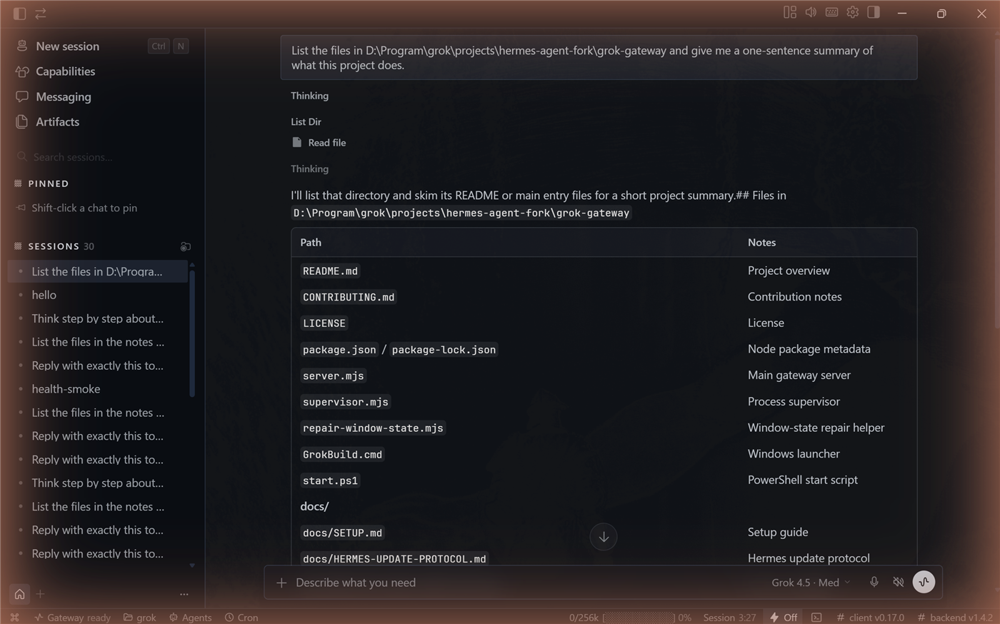

<div align="center">

# 🖥️ Grok Build Desktop

### The desktop app Grok's CLI never shipped with.

Grok ships as a CLI. A lot of people don't live in a terminal — so we built
it one. This bridge wires the real [Hermes desktop UI](https://github.com/NousResearch/hermes-agent)
(MIT, Nous Research) straight to the `grok` CLI you already have installed
and logged in. No API key. No cloud proxy. Your own subscription, your own
machine.

[](LICENSE)
[](#requirements)
[](https://nodejs.org)
[](#legal)
[](CONTRIBUTING.md)

<sub>Not affiliated with, endorsed by, or sponsored by xAI or Nous Research. "Grok" is a trademark of xAI; "Hermes" and related marks belong to Nous Research. See [Legal](#legal).</sub>

**[Features](#what-you-get) • [CLI vs API cost](#cli-subscription-vs-api-token--why-this-matters) • [Architecture](#how-it-works) • [Quick Start](#quick-start) • [Verify](#verifying-an-install) • [Self-Improvement](#self-improvement) • [Contributing](#contributing) • [FAQ](#faq--troubleshooting)**

<br>



<sub><i>An actual session — Grok reasoning, calling tools, and reporting back, streamed live into the desktop UI.</i></sub>

</div>

---

## 🤔 Why this exists

xAI ships Grok as a CLI. That's great for a terminal — not so great for
everyone else. **We built this because Grok Build CLI didn't have a GUI**,
and the best GUI shell we found (Hermes, MIT-licensed) already speaks a
documented remote-backend protocol. So instead of building a whole new
Electron app from scratch, we built a small, honest translator that speaks
Hermes's protocol on one side and drives your real `grok` CLI on the other.

- 🔑 **No API key.** Uses your already-authenticated CLI subscription.
- 🖥️ **A real desktop app**, not a wrapped terminal.
- 🏠 **Localhost only.** Nothing you type leaves your machine through us.
- 🕵️ **Zero telemetry.** We don't want your data; we don't collect it.

## ✨ What you get

| | |
|---|---|
| 💬 **Live streaming replies** | Text and reasoning both stream token-by-token, exactly as Grok produces them. |
| 🧠 **Visible reasoning** | Grok's chain-of-thought renders in the same disclosure panel Hermes ships with. |
| ✅ **Tool activity with checkmarks** | File reads, searches, long agentic runs — read live from the CLI's own session event log, not guessed. |
| 🔁 **Real multi-turn sessions** | Powered by the CLI's own `--resume` — genuine session continuity, not prompt-stuffing. |
| 🗂️ **Session list & history** | Titles, search, archive — stored locally, survives restarts. |
| 🧬 **Self-improvement** | Grok remembers durable facts across sessions, and reflects on genuinely hard tasks in the background. See [below](#self-improvement). |
| 🩹 **Self-healing gateway** | A supervisor restarts a crashed backend; a stall watchdog recovers a hung turn instead of leaving you staring at "running" forever. |
| 🔀 **Account fallback** | Have two Grok subscriptions? When one's weekly balance runs out, the gateway transparently switches the turn to the second account and keeps going — no interruption. Optional; see below. |
| 🪪 **Its own identity** | Grok Build runs as a separately-named, separately-iconed app — its own taskbar button, icon, and window title, never merged with a stock Hermes install running beside it. |
| 🖱️ **Real desktop control** | 50 tools — screenshot, click, type, scroll, drag, background/minimized-window control, accessibility tree, browser automation — via [cua-driver](https://github.com/trycua/cua) (MIT). A visible agent-cursor overlay shows what Grok is doing without ever touching your real mouse or keyboard focus. One-time install, see below. |
| 🌐 **Two browsers, your pick** | [Playwright MCP](https://github.com/microsoft/playwright-mcp) runs twice: an **isolated** Chrome (clean profile, logged into nothing — safe for scraping) and an **extension** mode that drives *your real* Chrome/Edge with your live logins and open tabs. Grok picks per task. See below. |

## 💰 CLI subscription vs. API token — why this matters

Grok Build Desktop **never uses an API key.** It only ever spawns your
already-logged-in `grok` CLI. That's a real, practical difference, not just
a privacy one:

- **CLI subscription** = one flat weekly allowance built for exactly this
  kind of heavy, tool-call-heavy agentic work (file reads, multi-step tasks,
  long sessions). It stretches a long way per hour of real work.
- **A separate xAI API token** = pay-per-raw-token against a much smaller,
  harder-capped pool. Every token — including all the invisible tool-call
  back-and-forth — gets charged directly against that pool.

Observed directly: two accounts, same person, same week — the one wired to
an **API token** (via native Hermes with a manually-entered key) ran out
*first*, despite less use and being the *newer* of the two. The other,
driving the same amount of work (actually more, and started a day earlier)
through the **CLI subscription** — via this project — comfortably outlasted
it. Same tasks, different bucket, very different runway.

**Bottom line:** Grok Build doesn't make any single task cheaper — a
message costs the same whether you type it into the raw CLI or through this
UI. What it does is guarantee every token you spend lands in the bucket
built to absorb heavy use, instead of the one that's metered per-token and
runs out fast. If you want an account to survive a week of real agentic
work, keep it on a CLI subscription, not a bare API key.

## 🏗️ How it works

<div align="center">

```
┌─────────────────────────────────────────────┐
│  Hermes.exe  (stock desktop app)             │
│  isolated profile — your normal Hermes       │
│  install is never touched                    │
└───────────────────┬───────────────────────────┘
                    │  HTTP + WebSocket, localhost only
                    ▼
┌─────────────────────────────────────────────┐
│  grok-gateway  (this repo)                   │
│  a small Node server on 127.0.0.1            │
│   • spawns your own CLI per turn             │
│   • tails the CLI's session event log        │
│     → live tool chips with checkmarks        │
│   • stall watchdog + crash supervisor        │
└───────────────────┬───────────────────────────┘
                    │  spawn, per turn
                    ▼
   grok -p "..." --output-format streaming-json
        [--resume <session>] [--experimental-memory]
```

</div>

The gateway speaks the Hermes backend's **exact** HTTP + WebSocket
contracts, so the stock, unmodified Hermes desktop app treats it as a
remote backend — a mechanism Hermes supports out of the box
(`HERMES_DESKTOP_REMOTE_URL`). We didn't fork or patch Hermes; we speak its
language.

> **Tested against:** Hermes commit `40e0e7ad` (2026-08-01), desktop backend
> contract **5**. Updating the Hermes install? Follow
> [docs/HERMES-UPDATE-PROTOCOL.md](docs/HERMES-UPDATE-PROTOCOL.md) — it is
> mandatory, backup-first, and exit-code-gated.

## 🧬 Self-improvement

Real Hermes self-improves by forking its Python agent after every turn to
judge what's worth remembering. We don't run that agent — so instead of
reimplementing it, we turned on Grok's **own** equivalent system and added
one thing Grok's CLI doesn't do headlessly.

- **Always on, free:** every turn runs with `--experimental-memory` — Grok's
  built-in cross-session memory (`~/.grok/memory/`: global + per-project
  `MEMORY.md`, semantic search, automatic recall on new sessions). Zero
  added cost or latency.
- **Gated on real difficulty, not every message:** Grok's rich reflection
  (`/flush`) is TUI-only, so after a task that was genuinely hard — 4+
  internal tool round-trips, or 3+ tool calls, or 3000+ reasoning tokens
  (all real signals Grok already reports, not a guess) — the gateway
  quietly asks Grok, in the background, to save anything durable using its
  own memory + skill tools. Invisible: no extra chat bubble, no "running"
  flicker, but the cost is still counted honestly in your session usage.

Tune it or turn it off with `GROK_REFLECT_ENABLED` / `GROK_REFLECT_MIN_*`
(see the comment block in `server.mjs`). Verified end-to-end in
`scripts/reflect-e2e.mjs`.

## 📋 Requirements

- Windows 10/11 (this is what's tested today; PRs for macOS/Linux welcome)
- [Node.js](https://nodejs.org) 18+
- [Hermes desktop app](https://github.com/NousResearch/hermes-agent) installed
- Grok CLI installed and logged in (`grok --version` works in a terminal)
- `git` on PATH (used for a local housekeeping stub; no network use)

## 🚀 Quick start

```powershell
git clone https://github.com/mjcity/grok-build-desktop
cd grok-build-desktop
npm install --omit=dev
.\GrokBuild.cmd
```

That's it. The launcher finds your Hermes install automatically (set
`GROK_BUILD_HERMES_DIR` if yours is somewhere unusual), starts the gateway on
`127.0.0.1:8787`, and opens Hermes wired to your Grok CLI in an **isolated
profile** — your normal Hermes setup is untouched and keeps working as plain
Hermes.

Full walkthrough + troubleshooting: [docs/SETUP.md](docs/SETUP.md).

<details>
<summary><b>🤖 Or: let your Grok connect itself</b> (click to expand)</summary>
<br>

This is how the author connected his. Paste this into your Grok CLI:

```
Clone https://github.com/mjcity/grok-build-desktop into a projects folder,
run "npm install --omit=dev" inside it, and read its docs/SETUP.md.
Then: (1) verify the grok CLI works headlessly by running
  grok --output-format streaming-json -p "Reply with exactly: WIRED_OK"
and confirming WIRED_OK streams back; (2) verify Hermes.exe exists (look in
%LOCALAPPDATA%\hermes\hermes-agent\apps\desktop\release\win-unpacked and
%LOCALAPPDATA%\Programs\Hermes — if missing, tell me how to install Hermes
from https://github.com/NousResearch/hermes-agent and stop); (3) run
GrokBuild.cmd from the repo; (4) verify end-to-end by running
  node scripts/chat-e2e.mjs
and node scripts/tools-e2e.mjs from the repo — both must print PASS and exit
0; (5) if anything fails, read %USERPROFILE%\.grok-hermes-desktop\logs and
fix per docs/SETUP.md troubleshooting, then re-verify. Report what passed.
```

The prompt is deliberately verification-first: your agent has to *prove*
the wiring with the repo's own exit-code-gated tests, not just claim success.

</details>

### 🖱️ Enabling real desktop control (optional)

Grok's screenshot/click/type/scroll tools need [cua-driver](https://github.com/trycua/cua)
installed once:

```powershell
irm https://raw.githubusercontent.com/trycua/cua/main/libs/cua-driver/scripts/install.ps1 | iex
```

Then add this to `~/.grok/config.toml`:

```toml
[mcp_servers.cua_driver]
command = 'C:\Users\<you>\AppData\Local\Programs\Cua\cua-driver\bin\cua-driver.exe'
args = ['mcp']
enabled = true
```

`GrokBuild.cmd` auto-starts the driver's background daemon on every launch if
it finds the binary installed — nothing else to configure. Skip this
entirely and everything else still works; Grok just won't have desktop
control tools available. Disable the auto-start with
`GROK_BUILD_NO_CUA_DRIVER=1`.

By default cua-driver's telemetry is **enabled** (it's a separate project
with its own policy, not something this repo controls) — disable it
yourself if you'd rather not: `cua-driver telemetry disable` (and
`cua-driver telemetry reset-id` to also erase the installation id).

### 🌐 Browser automation: isolated vs. your real Chrome

`GrokBuild.cmd` starts **two** Playwright MCP servers, and Grok chooses per task:

| | Port | Browser | Use it for |
|---|---|---|---|
| `playwright` | 8931 | Chrome we launch, **isolated profile** — logged into nothing | Scraping, throwaway automation, anything you don't want touching your real session |
| `playwright_chrome` | 8932 | **Your own running Chrome/Edge** — live logins, your open tabs | "Act on the tab I'm looking at", anything behind a login |

The isolated one works out of the box. The real-browser one needs Microsoft's
official extension — one click, no config:

> Install **[Playwright Extension](https://chromewebstore.google.com/detail/playwright-extension/mmlmfjhmonkocbjadbfplnigmagldckm)** from the Chrome Web Store.

Until it's installed, `playwright_chrome`'s tools stay present but return a
clear *"Playwright Extension not found — install it from …"* message rather
than failing cryptically. Skip the second instance entirely with
`GROK_BUILD_NO_PLAYWRIGHT_CHROME=1`.

> **Note on extension mode:** it depends on a fix for upstream
> [playwright-mcp#1646](https://github.com/microsoft/playwright-mcp/issues/1646)
> (a heartbeat that tore down the session ~5s after every tool call over
> Streamable HTTP, which hit extension mode hardest). The launcher sets
> `PLAYWRIGHT_MCP_PING_TIMEOUT_MS=0` to disable that heartbeat — without it,
> your connected tab drops moments after each call.

### 🔀 Adding a fallback Grok account (optional)

If you have a second Grok subscription (its own weekly *Grok Build* balance),
the gateway can fall back to it automatically when the first runs dry. Grok
stores its login in a per-home `auth.json`, and `GROK_HOME` points at that
home — so a second account just lives in a second home:

```powershell
# 1. Log the second account into its own home (its own browser sign-in):
$env:GROK_HOME = "$HOME\.grok-b"; grok login

# 2. (optional) give it the same MCP servers / model config as your primary:
Copy-Item "$HOME\.grok\config.toml" "$HOME\.grok-b\config.toml"
```

That's it — the gateway auto-detects any logged-in `~/.grok-b` and uses it as
a fallback. When your active account returns
`402 … Grok Build usage balance exhausted`, the gateway marks it spent,
switches the **same turn** to the next account, and retries transparently.
It then sticks with the fallback for the rest of the week (no wasted re-probe
of the dead account each turn) and returns to your primary after the weekly
reset (a gateway restart also re-probes it immediately). If every account is
spent, you get one clear message instead of a cryptic error.

Env knobs: `GROK_ACCOUNT_HOMES` (semicolon-separated homes, priority order —
overrides the `~/.grok`, `~/.grok-b` default) and
`GROK_ACCOUNT_RESET_WINDOW_MS` (how long a spent account is skipped before
being re-probed; default ~6.5 days).

## ✅ Verifying an install

Every claim above has an exit-code-gated test — no "trust me":

```powershell
node scripts\chat-e2e.mjs      # chat + multi-turn --resume recall
node scripts\feed-e2e.mjs      # reasoning/text streaming timeline
node scripts\tools-e2e.mjs     # tool chips live during a tool-using turn
node scripts\stall-e2e.mjs     # recovers from a genuinely hung grok.exe
node scripts\reflect-e2e.mjs   # self-improvement fires invisibly + unblocks
powershell -NoProfile -ExecutionPolicy Bypass -File scripts\verify-cold-start.ps1
```

Logs live in `%USERPROFILE%\.grok-hermes-desktop\logs\` — including a
request log that records the response shape of every API call the UI makes.

## 🌐 Other CLI-only models

The Hermes-contract side of the gateway is model-agnostic; the Grok-specific
part is one small turn-runner (spawn arguments, a 3-event NDJSON mapping,
and the session-event-log tail). The plan is an `adapters/` layer so any
agent CLI that can stream headlessly — Claude Code, Codex CLI, Gemini CLI,
and friends — gets the same desktop treatment. Grok just went first because
that's the gap we personally hit. Want an adapter for your favorite CLI?
Open an issue or a PR.

## 🛠️ Contributing

Yes — contributions are welcome. Read [CONTRIBUTING.md](CONTRIBUTING.md);
the short version: the verification scripts must pass, wrong-shaped 200s
are the cardinal sin (they crash the Hermes renderer), no fabricated
progress or fake status text, and new model support belongs in an adapter.

## ❓ FAQ & troubleshooting

<details>
<summary><b>Why does Grok Build get its own taskbar button and icon on Windows?</b></summary>
<br>
Because making that happen took four separate mechanisms, each fixed in
<code>scripts/build-grok-app.mjs</code> (all patches apply to Grok Build's own
app copy — your stock Hermes install is never modified):
<ol>
<li><b>Exe icon resource</b> (rcedit) — what Explorer and shortcuts show.</li>
<li><b>Window icon asset</b> — Hermes loads the live window icon from an
<code>apple-touch-icon.png</code> file, not the exe resource; the copy gets its own.</li>
<li><b>AppUserModelID</b> — Windows groups taskbar buttons by this ID, not by
exe or icon. The copy declares its own, so it never merges onto a pinned
Hermes button.</li>
<li><b>Icon path priority</b> — Hermes checks the asar-packed icon first, which
would silently win over the swapped file; the copy checks its swappable path
first.</li>
</ol>
If a future Hermes update changes any of these internals, the build script
logs a loud warning instead of silently shipping a merged identity.
</details>

<details>
<summary><b>Does this send my prompts anywhere?</b></summary>
<br>
No. The gateway binds to <code>127.0.0.1</code> only and spawns your own,
already-authenticated <code>grok</code> CLI as a local subprocess. There is
no cloud component in this repo.
</details>

<details>
<summary><b>Does it need my API key?</b></summary>
<br>
No — it drives the CLI you're already logged into with your subscription.
The gateway never asks for, sees, or transmits credentials.
</details>

<details>
<summary><b>Will it break my normal Hermes setup?</b></summary>
<br>
No. It launches Hermes with an <b>isolated profile</b>
(<code>%LOCALAPPDATA%\GrokBuildDesktop</code>) and points the update
mechanism at a harmless local stub so it can never rebuild your real
install. Your stock Hermes profile is never touched.
</details>

<details>
<summary><b>The gateway won't start / Hermes.exe not found</b></summary>
<br>
Set <code>GROK_BUILD_HERMES_DIR</code> to the folder containing
<code>Hermes.exe</code>, or check
<code>%USERPROFILE%\.grok-hermes-desktop\logs\gateway-out.log</code>. Full
list in <a href="docs/SETUP.md">docs/SETUP.md</a>.
</details>

<details>
<summary><b>A chat just says "running" forever</b></summary>
<br>
Should be fixed — the gateway watches for real silence (not just long
duration) and auto-recovers a genuinely stuck <code>grok.exe</code> after 3
minutes with a clear message, instead of hanging forever. See
<code>scripts/stall-e2e.mjs</code>.
</details>

## ☕ Support this project

If this saved you from the terminal, you can support development via the
sponsor button on this repo.

## ⚖️ Legal

- **License:** MIT (see [LICENSE](LICENSE)). No warranty of any kind.
- **Nothing bundled:** this repo contains only original bridge code. It does
  not include, redistribute, or modify the Hermes app or the Grok CLI — you
  install both yourself from their official sources, under their own
  licenses/terms.
- **Your credentials stay yours:** the gateway never asks for, sees, or
  transmits API keys or passwords. It launches your locally installed,
  already-authenticated CLI using its documented headless flags, and reads
  session files the CLI writes on your own machine.
- **Your responsibility:** use of the Grok CLI remains subject to xAI's
  terms and your subscription; use of Hermes is subject to its MIT license.
  This tool automates nothing beyond your own local machine.
- **Trademarks:** Grok™ (xAI), Hermes (Nous Research) and all other marks
  belong to their respective owners. This is an independent community
  project; please don't confuse it with an official product.

## 🙏 Acknowledgments

Built on the excellent MIT-licensed
[hermes-agent](https://github.com/NousResearch/hermes-agent) desktop shell
by Nous Research.

---

<div align="center">

<sub>Made because a CLI-only agent deserved a real desktop home. ⭐ star it if it saved you from the terminal.</sub>

[⬆ back to top](#grok-build-desktop)

</div>
